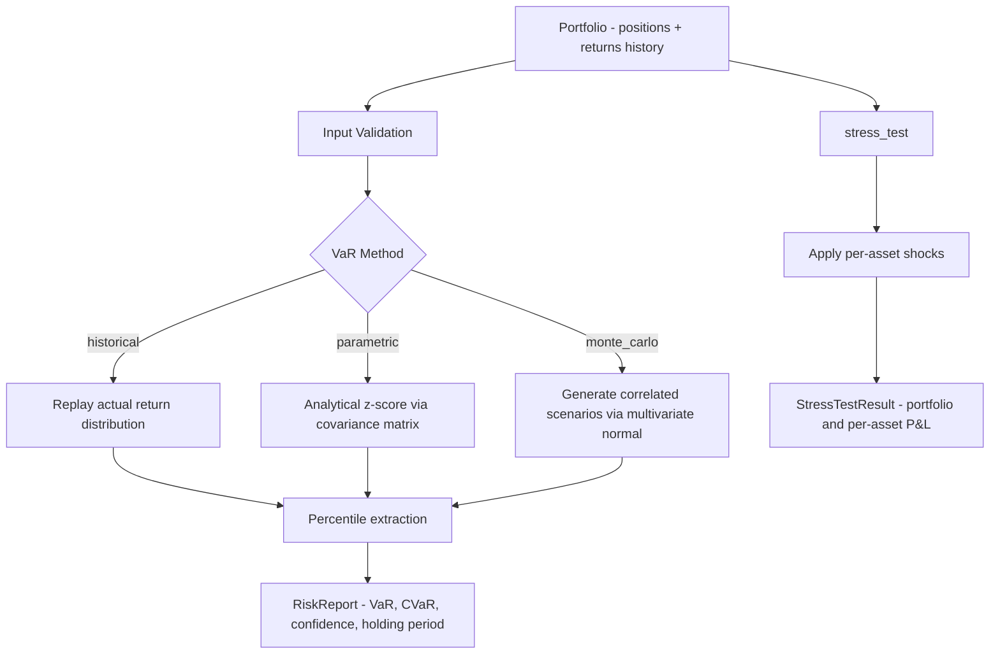

# real-time-risk-engine

> Python implementation of Monte Carlo portfolio Value-at-Risk — vectorized NumPy simulation supporting historical, parametric, and Monte Carlo methods with stress testing

[](https://github.com/jrajath94/real-time-risk-engine/actions)
[](https://codecov.io/gh/jrajath94/real-time-risk-engine)
[](https://opensource.org/licenses/MIT)
[](https://www.python.org/downloads/)

## Why This Exists

Portfolio VaR requires simulating thousands of correlated price paths. At end-of-day that is acceptable to run overnight. For intraday risk management with active hedging, you need VaR in sub-second time. This engine implements Monte Carlo VaR with fast vectorized NumPy simulation, designed for sub-second computation on realistic portfolio sizes. It covers all three standard VaR methods (historical, parametric, Monte Carlo), Expected Shortfall for Basel III compliance, and stress testing against historical crisis scenarios — in a single dependency-light Python library.

## Architecture


```mermaid
graph TD
    A[Portfolio - positions + returns history] --> B[Input Validation]
    B --> C{VaR Method}
    C -->|historical| D[Replay actual return distribution]
    C -->|parametric| E[Analytical z-score via covariance matrix]
    C -->|monte_carlo| F[Generate correlated scenarios via multivariate normal]
    D --> G[Percentile extraction]
    E --> G
    F --> G
    G --> H[RiskReport - VaR, CVaR, confidence, holding period]
    A --> I[stress_test]
    I --> J[Apply per-asset shocks]
    J --> K[StressTestResult - portfolio and per-asset P&L]
```

The engine is structured as pure functions — no shared state, no side effects. `historical_var`, `parametric_var`, and `monte_carlo_var` each take a `Portfolio` and configuration, validate inputs, compute the relevant distribution, and return an immutable `RiskReport`. `stress_test` applies a list of `StressScenario` objects (each mapping symbols to return shocks) and returns per-asset P&L breakdowns. Covariance estimation uses `numpy.cov` with validation that sufficient history exists before decomposition.

## Quick Start

```bash
git clone https://github.com/jrajath94/real-time-risk-engine.git
cd real-time-risk-engine
make install && make test
```

```python
import numpy as np
from real_time_risk_engine import Portfolio, Position, monte_carlo_var, stress_test, StressScenario

portfolio = Portfolio(positions=[
    Position(symbol="SPY", quantity=1000, current_price=450.0),
    Position(symbol="QQQ", quantity=500, current_price=380.0),
])

# Attach 252 days of historical returns (shape: T x N)
portfolio.returns_history = np.random.multivariate_normal(
    mean=[0.0003, 0.0004],
    cov=[[0.0004, 0.00034], [0.00034, 0.0006]],
    size=252,
)

report = monte_carlo_var(portfolio, confidence=0.99, num_simulations=10_000)
print(f"VaR (99%, 1-day): ${report.var_value:,.0f}")
print(f"CVaR (99%):       ${report.cvar_value:,.0f}")

# Stress test: 2008-style market shock
results = stress_test(portfolio, scenarios=[
    StressScenario(name="2008 crisis", shocks={"SPY": -0.40, "QQQ": -0.45}),
])
print(f"2008 scenario P&L: ${results[0].portfolio_pnl:,.0f}")
```

## Key Design Decisions

| Decision | Rationale | Alternative Considered | Tradeoff |
|----------|-----------|----------------------|----------|
| Three VaR methods in one library | Historical (non-parametric, distribution-free), parametric (fast, assumes normality), Monte Carlo (flexible, handles complex portfolios) — each appropriate for different use cases | Single method only | More surface area but covers the Basel III toolkit in a single dependency |
| Expected Shortfall alongside VaR | ES is coherent (satisfies subadditivity), required by Basel III FRTB; trivial to compute from the same Monte Carlo distribution | VaR alone | Negligible extra cost after simulation |
| Pure-function API with immutable `RiskReport` | No shared state; results cannot be mutated between computation and reporting | Stateful calculator object | Forces explicit re-computation on portfolio changes, but eliminates stale-result bugs |
| `_z_score_for_confidence` via rational approximation | Avoids scipy dependency; Beasley-Springer-Moro approximation is accurate to ~1e-6 | `scipy.stats.norm.ppf` (simpler, more precise) | One less dependency; precision is sufficient for all VaR use cases |
| Stress test as separate function | Stress scenarios are deterministic (no simulation), so separating them makes the API surface clearer | Embed stress test inside `monte_carlo_var` | More explicit — stress testing and probabilistic VaR answer different questions |

## Testing

```bash
make test    # Unit + integration tests
make lint    # Ruff + mypy
```

## License

MIT — Rajath John
